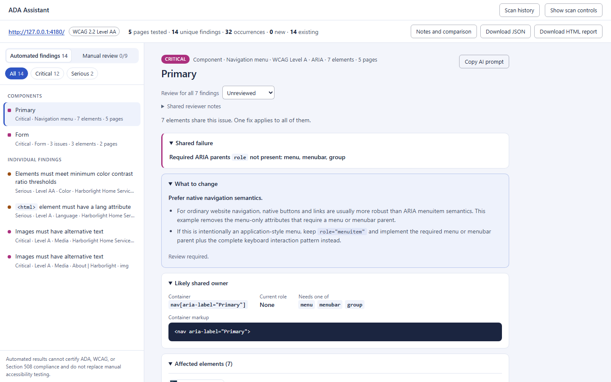
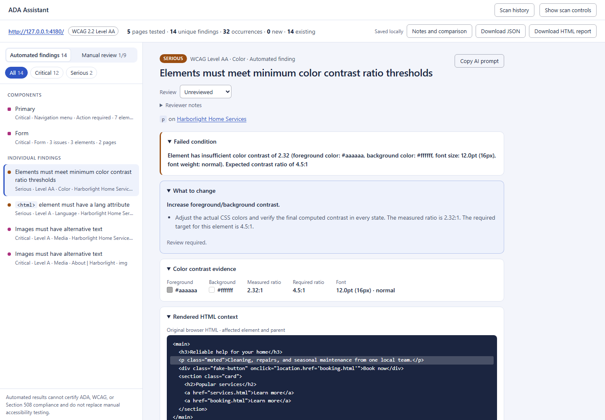

# ADA Remediation Assistant

Find accessibility problems on a website, see exactly what failed, and get a concrete fix for each one. It runs on your computer; nothing is uploaded.



> Automated scanning cannot certify ADA, WCAG, or Section 508 compliance. It does not replace keyboard testing, screen-reader testing, usability review, or evaluation by accessibility professionals and people with disabilities.

## Try it in two minutes

You need Node.js 20 or newer.

```bash
git clone https://github.com/gerryglz/ada-remediation.git
cd ada-remediation
npm install
npx playwright install chromium
```

Then, in two terminals:

```bash
npm run demo   # a small site with deliberate errors, on http://127.0.0.1:4180
npm run ui     # the dashboard, on http://127.0.0.1:4173
```

1. Open [http://127.0.0.1:4173](http://127.0.0.1:4173).
2. Paste `http://127.0.0.1:4180/` and check **Crawl same-origin pages**.
3. Select **Scan site**.

## What you get

- **Fix-first findings.** Each one opens on the failed condition and what to change, with the rendered HTML and a screenshot of the element.
- **Grouping by component.** Seven menu links with the same problem are one item with one fix, not seven.
- **An AI prompt per finding.** Paste it into a coding agent. It includes the evidence and the verification steps.
- **A review record.** Mark findings as action required, accepted risk, or false positive, and work through a manual checklist for what tools cannot test.
- **History and comparison.** Rescan later to see what is new, what remains, and what is resolved.
- **Exports.** JSON, a self-contained HTML report, and SARIF for code scanning.
- **More than the first paint.** Optional scans of menus, tabs, dialogs, and carousels, and of pages behind a login.



## Scan your own site

Build once with `npm run build`, then:

| What you have | Command |
| --- | --- |
| One page | `node dist/cli.js scan-url https://example.com/page` |
| A site to crawl | `node dist/cli.js scan-site https://example.com --max-pages 25` |
| A local dev server | `node dist/cli.js scan-url http://localhost:3000` |
| HTML files in a repository | `node dist/cli.js scan-repo .` |
| A page behind a login | `node dist/cli.js scan-url URL --storage-state auth.json` |

Add `--format html --output report.html` to save a report, or `--wcag-level A`, `AA`, or `AAA` to change the target. The [guide](docs/GUIDE.md) covers every option.

## Use it in CI

Fail a build when a serious finding appears:

```bash
node dist/cli.js scan-repo . --fail-on serious
```

A baseline lets an existing site fail only on new findings. See [the guide](docs/GUIDE.md#testing-method-7-test-in-ci-or-a-pull-request) and the [GitHub Actions example](docs/github-actions.yml).

## What it does not do

- **It does not prove compliance.** Many WCAG criteria need a person. The dashboard's manual checklist lists them.
- **It does not invent content.** No generated alt text, labels, or headings. Those need someone who knows the page.
- **It does not run code from a scanned repository.**

Only scan systems you own or are authorized to test.

## Privacy

- Scans run locally. URL scans send normal browser requests only to the pages being tested.
- History is saved under `.ada-remediation/history` in your home directory. It can include page HTML and screenshots, so review it before sharing.
- A login session file is used for one scan and never stored. Treat it as a secret.
- No AI service is called. The AI prompts are text for you to paste elsewhere.

## Documentation

- [Guide](docs/GUIDE.md): the dashboard, every scan method, reports, fixes, baselines, and history.
- [Dashboard design](docs/DESIGN.md): the rules the interface follows.
- [Changelog](CHANGELOG.md), [roadmap](docs/ROADMAP.md), and [upgrade notes](docs/UPGRADING.md).

## Development

```bash
npm run check      # typecheck, unit tests, build
npm run test:e2e   # drives the dashboard in Chromium
npm run test:a11y  # runs axe-core against the dashboard itself
```

## License

MIT
